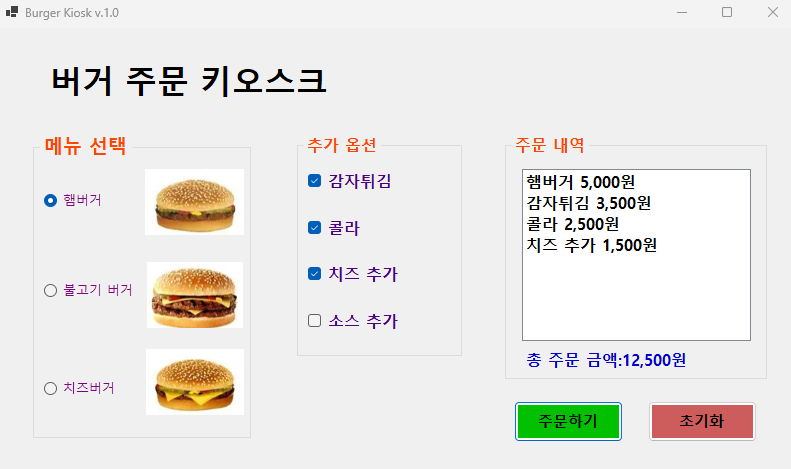
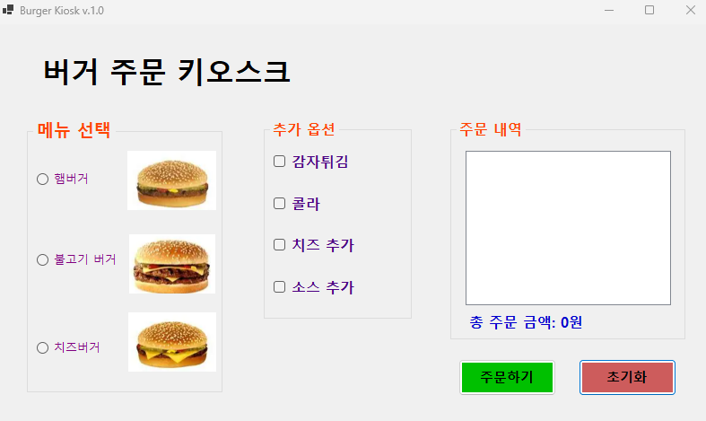

# BurgerKiosk

## 개요

- C# 프로그래밍 학습

- 1줄 소개: 사용자의 아이디와 패스워드를 입력받는 로그인 화면

- 사용한 플랫폼:
    - C#, .NET Windows Forms, Visual Studio, GitHub
- 사용한 컨트롤:
    - Label, ListBox, Button, PictureBox, CheckButton, RadioButton, GroupBox

- 사용한 기술과 구현한 기능:
    - GroupBox를 이용하여 그룹화
    - ToString("N0")을 이용하여 금액 표시할 때 천 단위 구분기호 표시하기
    - checkButton과 RadioButton을 false로 설정하여 초기화 버튼을 누르면 모든 메뉴가 선택 해제되도록 구현하기
    - label을 이용하여 총 금액 표시 및 에러메시지 표시하기

## 실행 화면 (과제1)
- 과제1 코드의 실행 스크린샷

- 과제 내용
    - 기본 UI 구성하기
    - 주문하기 버튼과 초기화 버튼의 기능 구성하기
    - 주문 내역과 총 금액을 표시하기

- 구현 내용과 기능 설명
    - 원하는 메뉴를 클릭하고 주문하기 버튼을 누르면 주문 내역과 총 금액이 표시된다.
    - 초기화 버튼을 누르면 주문 내역과 총 금액이 초기화된다.

- 사용한 기술과 구현한 기능:
    - checkButton과 RadioButton을 false로 설정하여 초기화 버튼을 누르면 모든 메뉴가 선택 해제되도록 구현하기
    - listbox에 메뉴 추가하기
    - if문을 이용하여 메뉴 선택에 따른 주문 내역과 총 금액 계산하기
    - 금액 표시할때 ToString("N0")을 이용하여 천 단위 구분기호 표시하기